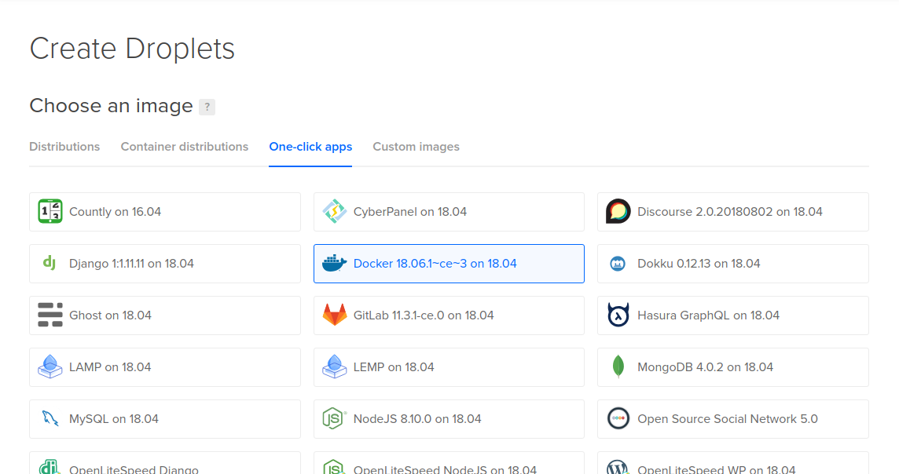
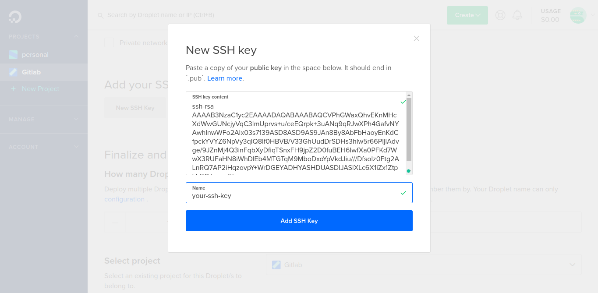

[](https://opensource.org/licenses/Apache-2.0)


# Gitlab CI/CD
A **zero to production** tutorial using Gitlab for CI/CD management. In this tutorial the setup enviroment will be:

- GitLab `(Source base code)`
- Digital Ocean `(Infrastructure)`
- Docker `(Containers)`

## Summary
1. [Create a droplet](#digital-ocean)
    1. [Create a public key](#ssh)
2. [Configure your droplet](#config)
3. [Create a gitlab runner](#runner)
4. [Create a docker image](#docker)
5. [Gitlab CI](#ci)
6. [Deploying your application](#deploy)

<div id='digital-ocean'/>

### Create a droplet

After made a account on [Digital Ocean website](https://www.digitalocean.com/), at the initial page you will click to create a `new project` on Digital Ocean:


Now you have a project on Digital Ocean, that basically serves for centralize one, or more, droplets in a same group. Click on `Create a droplet` to choose a type of droplet and your size. Because we are focused  on create a enviroment using Docker for deploy automatization, we'll also choose a droplet that fits with that environment.



Choosing a docker droplet, the `Digital Ocean` will give us a VM that already contains docker installed and also a firewall configuration that allows us to access the standard docker port remotely.

### Note

> **If you intent to use this tutorial for deploy a Spring Boot Application, it's better to choose at least the U$10/mo machine, because the 1GB RAM isn't enough to build the project, you'll face memory overflow issues.**

<div id='ssh'/>

#### SSH Access

Add your public ssh key to `Digital Ocean`. 



If you haven't already have a public ssh key, following this steps:

```
$ ssh-keygen -o
Generating public/private rsa key pair.
Enter file in which to save the key (/home/you/.ssh/id_rsa):
Created directory '/home/you/.ssh'.
Enter passphrase (empty for no passphrase):
Enter same passphrase again:
Your identification has been saved in /home/you/.ssh/id_rsa.
Your public key has been saved in /home/you/.ssh/id_rsa.pub.
```

And get your public ssh key: 

```
$ cat ~/.ssh/id_rsa.pub
ssh-rsa AAAAB3NzaC1yc2EAAasd24cZ/124zcA...you@you-pc
```
Copy and paste that on `Digital Ocean`, and that's it.

And after all, click on `Create`. 

<div id='config'/>

### Configure your droplet

<div id='runner'/>

### Create a gitlab runner

<div id='docker'/>

### Create a docker image

<div id='ci'/>

### Gitlab CI

<div id='deploy'/>

### Deploying your application